# Expresiones Regulares 🧩

- [Expresiones Regulares 🧩](#expresiones-regulares-)
  - [1. Introducción a las expresiones regulares 🔍](#1-introducción-a-las-expresiones-regulares-)
    - [1.1 - ¿Qué son las expresiones regulares? 🤔](#11---qué-son-las-expresiones-regulares-)
    - [1.2 - Historia y origen de las expresiones regulares 🕰️](#12---historia-y-origen-de-las-expresiones-regulares-️)
      - [Avances hasta la década de los 40 📜](#avances-hasta-la-década-de-los-40-)
      - [Pitts \& McCulloch: creando la neurona de McCulloch - Pitts 🧠](#pitts--mcculloch-creando-la-neurona-de-mcculloch---pitts-)
      - [Kleene la "estrella" del regex 🌟](#kleene-la-estrella-del-regex-)
      - [Ken Thompson, finalmente implementa 💻](#ken-thompson-finalmente-implementa-)
      - [Larry Wall implementa las expresiones por primera vez dentro de Perl 💡](#larry-wall-implementa-las-expresiones-por-primera-vez-dentro-de-perl-)
    - [1.3 - ¿Para qué sirven las expresiones regulares? 🎯](#13---para-qué-sirven-las-expresiones-regulares-)
    - [1.4 - Ejemplo de búsqueda de patrones con el comando grep y regexp 🔍](#14---ejemplo-de-búsqueda-de-patrones-con-el-comando-grep-y-regexp-)
      - [¿Qué es GREP? ¿Para qué se utiliza? 💻](#qué-es-grep-para-qué-se-utiliza-)
      - [Trabajando desde la web una terminal UNIX 🌐](#trabajando-desde-la-web-una-terminal-unix-)
      - [Creando el fichero a buscar 📂](#creando-el-fichero-a-buscar-)
      - [Ejemplo de uso de GREP 📋](#ejemplo-de-uso-de-grep-)
    - [1.5 - ¿Qué son los motores de ejecución de regexp? Y tipos engines de regexp 🚀](#15---qué-son-los-motores-de-ejecución-de-regexp-y-tipos-engines-de-regexp-)
      - [¿Qué son los motores de expresiones regulares? 🧩](#qué-son-los-motores-de-expresiones-regulares-)
      - [Distintos motores de expresiones regulares 🧰](#distintos-motores-de-expresiones-regulares-)
    - [1.6 - ¿Qué es el patrón/pattern y el match? 🎯](#16---qué-es-el-patrónpattern-y-el-match-)
      - [¿Qué es el patrón, pattern? 🧩](#qué-es-el-patrón-pattern-)
      - [¿Qué es el match (coincidencia)? ✅](#qué-es-el-match-coincidencia-)
      - [Instalando plugins para VSC ⚙️](#instalando-plugins-para-vsc-️)
  - [2. Single Characters 🔡](#2-single-characters-)
    - [2.1 - La estrella de Kleene \* 🌟](#21---la-estrella-de-kleene--)
      - [¿Qué es la estrella de Kleene dentro de las expresiones regulares? 🌟](#qué-es-la-estrella-de-kleene-dentro-de-las-expresiones-regulares-)
      - [Saltos de línea en regexp ↵](#saltos-de-línea-en-regexp-)
      - [Espacios en regexp 〰️](#espacios-en-regexp-️)
      - [Ejemplo de un uso de la estrella de Kleene 🌠](#ejemplo-de-un-uso-de-la-estrella-de-kleene-)
    - [2.2 - \[set\] Contenido en el grupo 🔣](#22---set-contenido-en-el-grupo-)
    - [2.3 - \[^set\] No contenido en el grupo 🚫](#23---set-no-contenido-en-el-grupo-)
    - [2.4 - \[set\] \[^set\] Definiendo  conjuntos/rangos 🎲](#24---set-set-definiendo--conjuntosrangos-)
      - [Seleccionando un conjunto de letras (abecedario al completo) 🔤](#seleccionando-un-conjunto-de-letras-abecedario-al-completo-)
      - [Añadiendo caracteres a un conjunto ➕](#añadiendo-caracteres-a-un-conjunto-)
      - [Upper \& Lower case range 🔠](#upper--lower-case-range-)
      - [Seleccionando un rango numérico 🔢](#seleccionando-un-rango-numérico-)
      - [Rango de caracteres “especiales” 🔣](#rango-de-caracteres-especiales-)
    - [2.5 - Uso del meta carácter joker, .\* \& \\char 🃏](#25---uso-del-meta-carácter-joker---char-)
      - [Uso del meta carácter . “el famoso joker” 🃏](#uso-del-meta-carácter--el-famoso-joker-)
      - [Joker entre dos caracteres 🅰🃏🅱](#joker-entre-dos-caracteres-)
      - [Doble jocker 🃏🃏](#doble-jocker-)
      - [Joker \& Kleene 🃏⭐](#joker--kleene-)
      - [Seleccionando meta caracteres utilizados en las expresiones regulares 🔤](#seleccionando-meta-caracteres-utilizados-en-las-expresiones-regulares-)
  - [3. Character Classes 🔤](#3-character-classes-)
    - [3.1 - Decimal digit \\d \& not decimal digit \\D 💯](#31---decimal-digit-d--not-decimal-digit-d-)
      - [Decimal digit 🔢](#decimal-digit-)
      - [Not a decimal digit 🙅‍♂️](#not-a-decimal-digit-️)
    - [3.2 - White-space characters \\s \& Not-white-space chars \\S 〰️](#32---white-space-characters-s--not-white-space-chars-s-️)
      - [White space characters \\s 〰️](#white-space-characters-s-️)
      - [Not white space characters \\S 🚫〰️](#not-white-space-characters-s-️)
    - [3.3 - Word \\w \& non-word \\W 🔠](#33---word-w--non-word-w-)
      - [Rango por defecto de Word \\w 🔡](#rango-por-defecto-de-word-w-)
      - [Ampliando el rango por defecto de Word \\w 🌅](#ampliando-el-rango-por-defecto-de-word-w-)
      - [Rango por defecto de non-word \\W 🚫🔠](#rango-por-defecto-de-non-word-w-)
      - [Ampliando el rango por defecto de non-word \\W 🌄](#ampliando-el-rango-por-defecto-de-non-word-w-)
      - [Alternation 〽](#alternation-)
    - [3.4 - Carriage returns y line feeds 🛒](#34---carriage-returns-y-line-feeds-)
      - [¿Qué son los retornos de carro? ◀🛒](#qué-son-los-retornos-de-carro-)
      - [¿Cómo podemos usar estos retornos de carro y saltos de línea? 🆙](#cómo-podemos-usar-estos-retornos-de-carro-y-saltos-de-línea-)
      - [Horizontal tab \\t 🔭](#horizontal-tab-t-)
      - [New line \\n 🆕](#new-line-n-)
  - [4. Quantifiers 🏁](#4-quantifiers-)
    - [4.1 - 0 or more times (\*), 1 or more times (+), 0 or 1 time (?) ☁](#41---0-or-more-times--1-or-more-times--0-or-1-time--)
      - [¿Qué son los quantifiers/cuantificadores? ⌛](#qué-son-los-quantifierscuantificadores-)
      - [0 or more times \* 🕗](#0-or-more-times--)
      - [1 or more times + 🕒](#1-or-more-times--)
      - [0 or 1 time ? 🕕](#0-or-1-time--)
    - [4.2 - Exactly n times {n}, at least n times {n,} and from n to m times {n,m} 🕛](#42---exactly-n-times-n-at-least-n-times-n-and-from-n-to-m-times-nm-)
      - [Exactly n times {n} 🕛](#exactly-n-times-n-)
      - [At least n times {n,} 🕕](#at-least-n-times-n-)
      - [From n to m times {n,m} 🕖](#from-n-to-m-times-nm-)
    - [4.3 - Greedy/codicioso VS Lazy/Perezoso 🦥](#43---greedycodicioso-vs-lazyperezoso-)
      - [Greedy/Codicioso 💰](#greedycodicioso-)
      - [Lazy/Perezoso 🦥](#lazyperezoso-)
  - [5. Anchors 🔱](#5-anchors-)
    - [5.1 - Start at beginning of String (^) \& end of String ($) ⚓](#51---start-at-beginning-of-string---end-of-string--)
      - [Start at beginning of String ^ ⚓](#start-at-beginning-of-string--)
      - [End of String $ 🚢](#end-of-string--)
      - [Combinando ^ con $ 🚢⚓](#combinando--con--)
    - [5.2 - Word buoundary \\b \& not word boundary \\B 🚝](#52---word-buoundary-b--not-word-boundary-b-)
      - [Word buoundary \\b sin texto ⚓](#word-buoundary-b-sin-texto-)
      - [Word buoundary \\b con texto ⚓📋](#word-buoundary-b-con-texto-)
      - [Not word boundary \\B caracteres de entre palabras 📖](#not-word-boundary-b-caracteres-de-entre-palabras-)
  - [6. Alternation ⚡](#6-alternation-)
    - [6.1 - Alternation |](#61---alternation-)
    - [6.2 - Match y match  matchea la expresión completa o sino no se matchea 🎯](#62---match-y-match--matchea-la-expresión-completa-o-sino-no-se-matchea-)
  - [7. Groups rarunos 🐸](#7-groups-rarunos-)
  - [🥩Chuletita Cheat sheet🥩](#chuletita-cheat-sheet)
  - [🤓Webs recomendadas🤓](#webs-recomendadas)


## 1. Introducción a las expresiones regulares 🔍

### 1.1 - ¿Qué son las expresiones regulares? 🤔

El **término de expresiones regulares nace a partir del término inglés Regular Expressions**, del que también surgen **varias abreviaturas como RegEx (de REGular EXpressions) o RegExp (de REGular EXPressions)**.  

| 🧠 Las expresiones regulares (RegEx), no son un lenguaje de programación, sino una serie de símbolos (expresiones o patrones) que nos permitirán definir patrones de búsqueda en cadenas de texto. |
|-|

Por tanto, no son nada más y nada menos que una **"especie de lenguaje" para manipular/realizar búsquedas sobre** los archivos de texto o simplemente sobre textos **sin la necesidad de que estos estén contenidos en el interior de un fichero.**

### 1.2 - Historia y origen de las expresiones regulares 🕰️

#### Avances hasta la década de los 40 📜

**La historia de las expresiones regulares se remonta a la década de 1940 y está estrechamente relacionada con los avances en la lógica matemática y la teoría de la computación.**

| 🤖 El desarrollo de las expresiones regulares se basó en investigaciones previas sobre autómatas finitos y la formulación de lenguajes formales. Durante la década de 1930 y 1940, varios matemáticos y lógicos, incluyendo a Alonzo Church, Alan Turing, Emil Post y otros, estaban explorando los conceptos fundamentales de la teoría de la computación y la lógica matemática. |
|-|

#### Pitts & McCulloch: creando la neurona de McCulloch - Pitts 🧠

**El origen o los inicios de la creación de las expresiones regulres, tiene su origen en la neurociencia y no en la ciencia de la informática. Concretamente en 1943, en el estudio realizado por los padres de la neurona de Pitts & McCulloch.**

Esta investigación fue plasmada en el documento ["A Logical calculus of the ideas immanent in nervous activity"](doc/mccolloch.logical.calculus.ideas.1943.pdf).

**Los avances realizados en este estudio fueron utilizados a posteriori dentro del campo de la informática para en la idealización de las expresiones regulares.**

#### Kleene la "estrella" del regex 🌟

**En la década de 1950, el matemático y lógico estadounidense Stephen Cole Kleene introdujo el término "expresión regular" por primera vez dentro de su trabajo de investigación llamado** ["Representation of events in nerve nets and finite automata"](doc/RM704.pdf) en la que refleja sus investigaciones en teoría de autómatas y lenguajes formales.

| 🤖 Cuando hablamos de teoeía de autómatas, nos referimos a la rama de la informática teórica y las matemáticas que se centran en el estudio de modelos abstractos de máquinas o dispositivos que pueden realizar ciertas operaciones sobre cadenas de símbolos. La teoría de lenguajes formales estudia patrones de cadenas de símbolos y sus propiedades mediante gramáticas y autómatas, siendo fundamental en la comprensión y análisis de lenguajes de programación, procesamiento de texto y verificación de software.   |
|-|

Si nos fijamos, **en la primera línea podemos ver que el proyecto se llama RAND y fue encargado por la U.S. AIR FORCE.**

**Las expresiones regulares son patrones textuales que describen conjuntos de cadenas de caracteres. Permiten la descripción y manipulación** de lenguajes regulares, que son un tipo de lenguaje formal en la teoría de lenguajes formales.

**Estas expresiones se utilizan en muchos contextos, incluyendo la búsqueda y manipulación de texto en editores de texto, procesamiento de cadenas en programación, y en el diseño de motores de búsqueda y sistemas de filtrado de información.**

**Kleene formalizó las expresiones regulares utilizando notación matemática y desarrolló métodos para analizar y generar patrones de texto utilizando estas expresiones.**

Para ello, **utilizó símbolos como "*" para denotar repetición y "+" para denotar al menos una repetición de un símbolo o grupo de símbolos en una expresión.**

Estos símbolos y la notación matemática que desarrolló **permitieron describir patrones de manera más concisa y precisa.**

| 🤖 Con el tiempo, las expresiones regulares se convirtieron en un componente esencial en la programación y la manipulación de texto en sistemas informáticos. Se incorporaron en varios lenguajes de programación y herramientas, lo que permitió a los desarrolladores realizar tareas de búsqueda, extracción y manipulación de patrones de manera más eficiente. Desde entonces, las expresiones regulares han evolucionado y se han vuelto ubicuas en la informática y el procesamiento de datos.   |
|-|

#### Ken Thompson, finalmente implementa 💻

Durante los años **60, Ken Thompson, un científico de la computación** que destaca por ser **uno de los creadores del sistema operativo Unix, tuvo un papel muy significativo** en la evolución y popularización de **las expresiones regulares en el ámbito de la informática.**

Aunque Stephen Cole Kleene introdujo el concepto de expresiones regulares en la teoría matemática, **Ken Thompson fue quien llevó estas ideas a la práctica y las integró en el mundo de la programación y la informática práctica.**

Thompson **implementó las expresiones regulares dentro de un editor de texto llamado “ED” lo que permitía a los usuarios realizar operaciones** con la finalidad de que los usuarios pudieran realizar ciertas operaciones **de edición de texto utilizando expresiones regulares.**

Aquí podemos ver **el artículo** ["Regular Expression Search"](doc/Thompson-1968.pdf) **escrito por el mismo Thompson para Bell Telephone Laboratories, en el que detalla aspectos sobre el algoritmo que utilizó para implementar las expresiones regulares dentro del editor de texto EQ.**

| 🤖 Thompson realiza el hito que representa el punto de entrada de las expresiones regulares RegEx dentro de la informática.   |
|-|

| 🎓 Posteriormente, Thompson trabajando junto con Dennis Ritchie, desarrollaron el lenguaje de programación "grep" (que significa "global regular expression print"), que permitía buscar patrones en archivos y mostrar las líneas que coincidían con esas expresiones regulares. La utilidad "grep" se convirtió en una herramienta esencial en Unix y otros sistemas operativos basados en Unix.   |
|-|

**Aunque las expresiones regulares han evolucionado a lo largo del tiempo,** y en algunos aspectos nada tiene que ver con las de aquel entonces, tal y como podéis observar en el siguiente [memorando escrito para Bells Labs en 1970](doc/qedman.pdf), **algunas de las características de expresiones regulares de QED se siguen manteniendo a día de hoy después de tantos años.**

#### Larry Wall implementa las expresiones por primera vez dentro de Perl 💡

**Larry Wall, el creador del lenguaje Perl, introdujo expresiones regulares dentro del lenguaje.**

**Consiguiendo que las expresiones regulares fueran fáciles de usar** y agregando características avanzadas como remplazos y capturas. También popularizó conceptos como "greediness" en las coincidencias. 

| 📌 Sus contribuciones influyeron en cómo se usan las expresiones regulares en la programación.   |
|-|


### 1.3 - ¿Para qué sirven las expresiones regulares? 🎯

**Las expresiones regulares son extremadamente útiles en determinadas situaciones donde necesitas realizar tareas de búsqueda y manipulación de texto de manera avanzada.**

Algunos casos típicos en los que se utilizan expresiones regulares son:

1. **Búsqueda de patrones: Puedes buscar** palabras específicas, números, fechas o **cualquier patrón de caracteres en un texto de manera más flexible y eficiente que con una simple búsqueda de texto.**
2. **Validación de datos: Puedes validar si una cadena cumple con un formato específico**, como un número de teléfono, dirección de correo electrónico, código postal, etc.
3. **Extracción de información: Puedes extraer partes específicas de una cadena que cumplan con un patrón determinado**, como obtener todos los enlaces de una página web o extraer datos estructurados de un texto.
4. **Reemplazo y manipulación de texto: Puedes realizar operaciones de reemplazo, eliminación o modificación de texto basado en patrones** específicos.

Algunos ejemplos de todo esto podrían ser:

- El proceso de **validar si un email** tiene un formato correcto o no.
- **Substituir** cierta **información dentro de un documento/archivo.**
- Realizar una **modificación masiva sobre múltiples INSERTs de SQL.**

### 1.4 - Ejemplo de búsqueda de patrones con el comando grep y regexp 🔍

**Una vez aterrizados en la historia y en las expresiones regulares, vamos a ver** un pequeño ejemplo de **cómo trabajar con ellas mediante al comando grep solamente disponible dentro de los sistemas operativos que están basados en UNIX.**

#### ¿Qué es GREP? ¿Para qué se utiliza? 💻

**GREP es un comando de terminal que nos permite realizar búsquedas globales.**

**GREP es el acrónimo de Global Regular Expression Print** el significado de estas siglas es el siguiente:

- G 🡢 **Global**
- RE 🡢 **Regular Expressions**
- P 🡢 **Print**

**Con GREP**, por tanto, **vamos a realizar una búsqueda Global**, es decir, **sobre una serie de documentos situados en un directorio y finalmente vamos a hacer un Print** (impresión) **de todas las líneas coincidentes mediante a una Regular Expresion.**

| 🔎 GREP destaca por ser un marcar un antes y un después, un gran paso en cómo realizar búsquedas en Unix. |
|-|

#### Trabajando desde la web una terminal UNIX 🌐

Para realizar dicha prueba, **vamos a trabajar desde una emulación web de un sistema UNIX.**

Para ello, entramos en la siguiente web: [Entra en la web](https://bellard.org/jslinux/).

Una vez dentro, **seleccionamos el sistema operativo** con el que queremos trabajar en mi caso usaré la siguiente versión:


Una vez dentro, como podréis observar, se nos abrirá una terminal de Linux en el propio browser **desde el que podremos ejecutar los comandos pertinentes:**


#### Creando el fichero a buscar 📂

1. Primeramente, **vamos a** hacer un ls (de list) para **listar todos los ficheros actuales:**

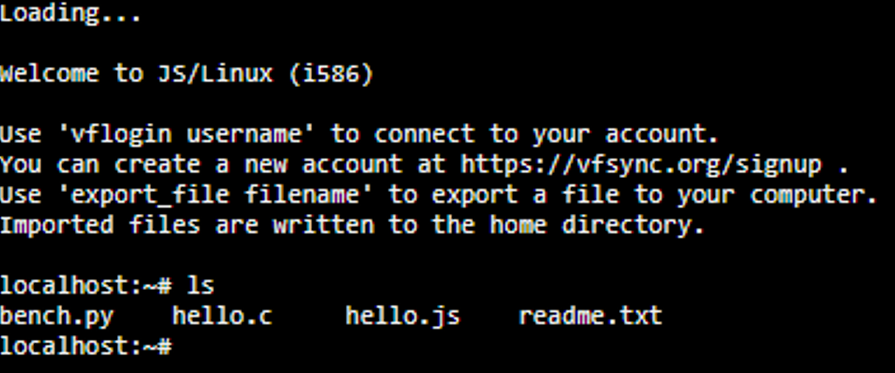

2. Posteriormente, **creamos un fichero mediante el comando cat de la siguiente manera:**

Escribimos 🡢 `cat > (nombre del fichero)`

En su interior, **vamos a escribir el contenido sobre el que realizaremos la búsqueda con GREP.**

Para salir del documento si queremos **guardar** los cambios utilizamos **Ctrl + D**, o si quisiéramos **salir sin guardar** el documento **Ctrl + C**.

Finalmente, una vez guardado el fichero, **vamos a hacer un ls para mostrar si hemos creado el fichero correctamente**.

1. Si ejecutamos **el comando tail** junto al nombre del fichero que acabamos de crear, podemos mostrar el contenido del fichero que acabamos de introducir en el paso anterior:


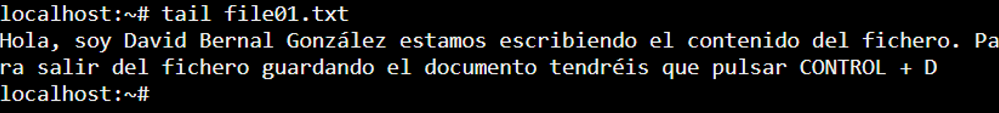

#### Ejemplo de uso de GREP 📋

1. Primer Ejemplo, finalmente, **vamos a realizar la primera búsqueda de la expresión regexp más sencilla de todas, una palabra sin más.**
**Para ello, tenemos que utilizar el comando grep junto a la expresión regular** que vamos a buscar, en este caso la palabra David **entrecomillada. E inmediatamente después, la ruta sobre la que queremos realizar la búsqueda.**

Un ejemplo podría ser el siguiente:

| 📄 Para realizar una búsqueda global, es decir, sobre todos los directorios utilizamos * |
|-|

**Si realizamos la búsqueda con todos los caracteres en minúsculas**, fijaros que la consola **no imprimirá ningún resultado**:

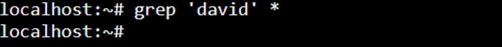

En cambio, **si repetimos la misma operación con el nombre con la D en mayúscula, ahora si que** podemos observar que **nos devuelve el resultado correctamente:**

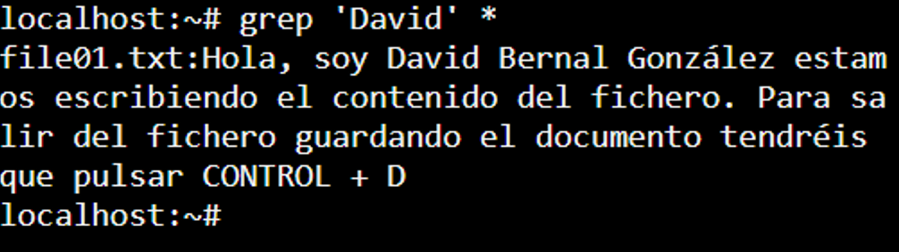

2. Segundo Ejemplo, **si queremos que la búsqueda no sea case-sensitive,** es decir, a mayúsculas y minúsculas **podemos añadir el flag (la bandera) -i.** Vamos a verlo:

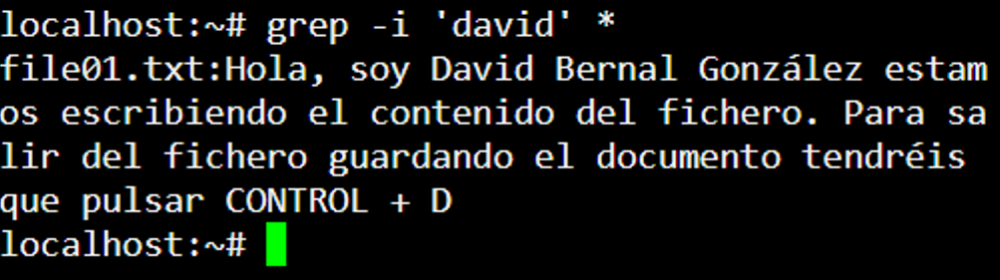

3. Tercer Ejemplo, Si quisiéramos **buscar los ficheros que empiecen por Hola,** haríamos lo siguiente:

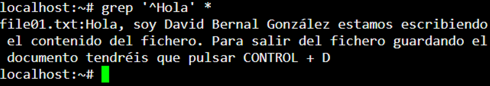

4. Cuarto Ejemplo, Si quisiéramos **buscar los ficheros que acaben por D haríamos lo siguiente:**

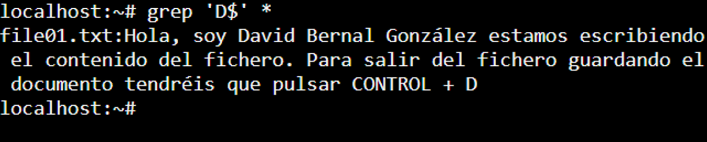

### 1.5 - ¿Qué son los motores de ejecución de regexp? Y tipos engines de regexp 🚀

#### ¿Qué son los motores de expresiones regulares? 🧩

Los **motores (engines) de expresiones regulares, son programas o bibliotecas que implementan la capacidad de realizar procesamiento e interpretación de patrones de expresiones regulares.**

Estos modelos **permiten buscar, comparar y manipular texto basándose en patrones definidos por las expresiones regulares.**

#### Distintos motores de expresiones regulares 🧰

**Los motores de expresiones regulares se encuentran tanto en lenguajes de programación** (como Java, Python, JavaScript, Perl, PHP, .NET, etc.) **como herramientas de software** (Eclipse, Visual Studio Code, etc.) **e incluso en sistemas operativos.**

| 🔧 Cada motor puede tener su propia sintaxis y características específicas para expresiones regulares, pero la idea general es la misma: utilizar patrones para realizar operaciones complejas en cadenas de texto. |
|-|

Algunos de los principales motores para ejecutar expresiones regulares son:

1. **Oniguruma** 🡢 **Es un motor de expresiones regulares ampliamente utilizado** que se encuentra en Visual Studio Code, TextMate, Ruby, PHP y otros.  
**Es conocido por su soporte completo de expresiones regulares con muchas características y extensiones.**

2. **Java (java.util.regexp)** 🡢 **Proporciona `java.util.regex`, un paquete/librería que contiene** un conjunto de clases que nos va a proporcionar **un motor de expresiones regulares para trabajar con expresiones regulares dentro de Java. Entre las clases más utilizadas se encuentra `Pattern` y `Matcher`.**  
Estas clases **permiten compilar expresiones regulares**, buscar coincidencias **y realizar operaciones de reemplazo en cadenas.**

3. **JavaScript (Regexp)** 🡢 **Los navegadores y Node.js utilizan el motor de expresiones regulares incorporado en JavaScript**, que se accede a través de la clase `RegExp`. Por lo que **podemos utilizar expresiones regulares de forma nativa en JavaScript para realizar búsquedas y reemplazos en cadenas de texto.**

4. **GNU Grep (grep)** 🡢 **`grep` es una herramienta de línea de comandos disponible en sistemas Unix** como por ejemplo Linux, **que nos permite realizar búsquedas de patrones utilizando expresiones regulares.**

5. **PCRE (Perl Compatible Regular Expressions)** 🡢 **PCRE es un motor de expresiones regulares compatible con Perl, que además se utiliza en lenguajes como PHP, Python (a través del módulo `re`), y otros.** Ofrece una amplia gama de funcionalidades, incluyendo expresiones regulares recursivas.

6. **PHP (PCRE)** 🡢 **PHP utiliza el motor PCRE para su soporte de expresiones regulares.** Puedes utilizar la función `preg_match()` y otras funciones relacionadas para trabajar con expresiones regulares.

7. **Ruby (Regexp)** 🡢 Ruby **proporciona soporte nativo para expresiones regulares a través de la clase `Regexp`.**

8. **C# (.NET Regex)** 🡢 **C# proporciona soporte para expresiones regulares a través** de la clase `System.Text.RegularExpressions.Regex`.

9. **Python (re)** 🡢 **Python incluye un módulo llamado `re`** que **ofrece soporte para expresiones regulares.** Este módulo proporciona funciones para trabajar con expresiones regulares que nos permitirán compilar expresiones regexp, buscar coincidencias y realizar cambios **de manera similar a Java.**

| ℹ Estos son solo algunos ejemplos de los motores de expresiones regulares disponibles en diferentes lenguajes y herramientas. Cada uno de ellos puede tener diferencias en la sintaxis o en las características admitidas, pero todos están diseñados para proporcionar una forma poderosa de realizar operaciones avanzadas de búsqueda y manipulación de texto basadas en patrones. |
|-|

### 1.6 - ¿Qué es el patrón/pattern y el match? 🎯

#### ¿Qué es el patrón, pattern? 🧩

Cuando hablamos de **patrón** o de pattern, dentro del contexto de las expresiones regulares, **es a la expresión, es decir, la secuencia de caracteres  mediante la cual intentaremos realizar un `match` dentro de un fichero gracias a un motor de expresiones regulares.**

| 🧐 Cada carácter definido dentro del patrón representa una instrucción para buscar cierto tipo de contenido en el texto. Por tanto, el patrón no es nada más que una combinación de caracteres literales y caracteres especiales que tienen ciertos significados específicos. Los cuales formarán la expresión regular a partir de la cual buscaremos las coincidencias (matchings) dentro de un texto. Dicho patrón que buscará si una determinada expresión regular existe dentro de un determinado texto. |
|-|

#### ¿Qué es el match (coincidencia)? ✅

En el contexto de las expresiones regulares **un **match,** se refiere a cada una de las instancias/coincidencias encontradas dentro del texto que cumple con lo definido dentro del patrón de la expresión regular.**

En otras palabras, **cuando aplicas una expresión regular, es decir, un patrón generando una cadena de texto, y esa cadena de texto buscará en el interior de un texto de tal forma que**, cada resultado encontrado será una coincidencia o un "match".

`^\d{3}`

| 📌Dicho patrón significa selecciona todas las líneas que empiecen por 3 dígitos. |
|-|

En resumen, **el patrón en una expresión regular define cómo se busca o manipula el texto. Contiene una serie de caracteres que representan reglas específicas para encontrar patrones particulares en las cadenas de texto.**

#### Instalando plugins para VSC ⚙️

Existen **determinadas expresiones regulares que pueden llegar a ser muy complejas y cuya lectura puede ser todo un reto.**

Un ejemplo de ello es **General Email Regex (RFC 5322 Official Standard)** la cual nos permite realizar la **validación de un email con un 99,99% de eficiencia:**

```
(?:[a-z0-9!#$%&'*+/=?^_`{|}~-]+(?:\.[a-z0-9!#$%&'*+/=?^_`{|}~-]+)*|"(?:[\x01-\x08\x0b\x0c\x0e-\x1f\x21\x23-\x5b\x5d-\x7f]|\\[\x01-\x09\x0b\x0c\x0e-\x7f])*")@(?:(?:[a-z0-9](?:[a-z0-9-]*[a-z0-9])?\.)+[a-z0-9](?:[a-z0-9-]*[a-z0-9])?|\[(?:(?:25[0-5]|2[0-4][0-9]|[01]?[0-9][0-9]?)\.){3}(?:25[0-5]|2[0-4][0-9]|[01]?[0-9][0-9]?|[a-z0-9-]*[a-z0-9]:(?:[\x01-\x08\x0b\x0c\x0e-\x1f\x21-\x5a\x53-\x7f]|\\[\x01-\x09\x0b\x0c\x0e-\x7f])+)\])
```

**Si tenemos que interpretar dicha expresión sin ayuda alguna**, esto **sería una tarea muy muy muy compleja.**

Por ello, **tenemos determinadas web y plugins que nos permiten simplificar en media de lo posible determinadas tareas con regexp.** Un ejemplo de ello es la siguiente web: [**https://jex.im/regulex/**](https://jex.im/regulex/)

| 🏗 Si pegamos el código de la expresión regular podemos generar un  esquema que nos permitirá entender que hace la expresión: |
|-|


## 2. Single Characters 🔡

### 2.1 - La estrella de Kleene * 🌟

#### ¿Qué es la estrella de Kleene dentro de las expresiones regulares? 🌟

**La estrella de Kleene (*) es el meta carácter más potente de todos** con el que la comunidad trata de homenajear de Kleene al que en general consideran “el padre” de las expresiones regulares.

| 📌 Por el momento solamente vamos a ver solamente uno de sus usos. Aunque me gustaría matizar que con la estrella de Kleene podemos realizar también otras funcionalidades que ya veremos cuando lleguemos a dicho apartado. |
|-|

`/*` 🡢 Seleccionamos cualquier carácter (incluido el salto de línea \n)

#### Saltos de línea en regexp ↵

Basándonos en este mensaje que tiene 3 líneas:

```
ojo loro rioja hoja
  
 
```

1. La primera línea contiene texto además de un salto de línea (\n).

2. La segunda línea contiene dos espacios y además también contiene otro salto de línea (\n).

3. Finalmente, la tercera línea contiene un solo espacio, pero al no haber más líneas no contiene ningún salto de línea.

| 📌 Los saltos de línea no se pueden visualizar a golpe de ojo dentro de un documento. |
|-|

Para poder visualizarlos, podemos ayudarnos de regexp. Para ello, realizamos un `\n` podemos matchear todos los saltos de línea que hay en nuestro documento.

#### Espacios en regexp 〰️

| 📌 Los saltos de línea los podemos visualizar/detectar/identificar fácilmente dentro de un documento por la separación de los caracteres. |
|-|

Además de ello, si seleccionamos el texto al completo en el interior del IDE (Visual Studio Code), podemos observar como aparece una especie de puntito · el cual representa cada uno de los espacios.

Si utilizamos \s o en su defecto escribimos un espacio sin nada más, podemos ver que hacemos un match de todos los espacios del documento.

#### Ejemplo de un uso de la estrella de Kleene 🌠

En cambio, si utilizamos la estrella de Kleene, podemos ver que se seleccionan todos los caracteres inclusive los saltos de línea y espacios.

```
ojo loro rioja hoja


```

| 📌 Por ello, decimos que la estrella de Kleene es el meta carácter más poderoso de todos, engloba todo incluso los saltos de línea o espacios. |
|-|

### 2.2 - [set] Contenido en el grupo 🔣

En esta sección vamos a empezar a aprender como trabajar con grupos de caracteres además de explicar que diferencias hay entre patrón este tipo de grupos y los caracteres literales. ¡Vamos a ello!

| 📌 [carácter/es] buscará cualquier carácter incluido entre los []. A diferencia de los caracteres literales anteriores, con esta manera matcheará todo lo contenido en el interior del paréntesis independientemente de que estén definidos consecutivamente o no. |
|-|

### 2.3 - [^set] No contenido en el grupo 🚫

[^carácter/es] realizará el match de cualquier carácter que NO esté incluido dentro de los corchetes [] independiente de si es consecutivo o si no.

### 2.4 - [set] [^set] Definiendo  conjuntos/rangos 🎲

#### Seleccionando un conjunto de letras (abecedario al completo) 🔤

De la misma forma que podemos definir un rango mediante a una secuencia de caracteres literales, podemos realizarlo mediante a un rango/conjunto de la siguiente manera:

`[a-z]` Nos permite definir un rango específico dentro del patrón.

| 🚨 A excepción de la ñ tanto en mayúscula como minúscula ya que la informática por decirlo así “está hecha en inglés” y la ñ no existe en dicho lenguaje. |
|-|

#### Añadiendo caracteres a un conjunto ➕

Si queremos que dicho rango añada la `ñ` también deberemos de añadirla al conjunto de la siguiente manera `[a-zñ]`.

#### Upper & Lower case range 🔠

Las expresiones regulares pueden ser "case sensitive" o "case insensitive", lo que significa que pueden o no distinguir entre letras mayúsculas y minúsculas en el texto que se está analizando.

#### Seleccionando un rango numérico 🔢

`[0-9]` También podemos utilizar rangos de numéricos.

#### Rango de caracteres “especiales” 🔣

`[À-ÿ]` Otro ejemplo de como seleccionar los caracteres especiales (acentuados, dieresis, eñes…), es decir, que no son utilizados en el lenguaje inglés.

### 2.5 - Uso del meta carácter joker, .* & \char 🃏

#### Uso del meta carácter . “el famoso joker” 🃏

`.`  meta carácter también conocido como el “joker”, selecciona cualquier carácter, de una forma similar a “un comodín” **¡A excepción de los saltos de línea!** Por lo que poder decirlo así es casi igual de poderoso que la estrella de Kleene. Decimos ¡Casi! ya que es un poquitín menos potente.

- El primer uso que podríamos con `.` sería el de seleccionar todos los caracteres del documento.

#### Joker entre dos caracteres 🅰🃏🅱

- `carácter/es.carácter/es` 🡢 Aunque el uso más habitual del . no es el anterior, sino el utilizarlo como una especie de “carácter comodín” de un solo carácter. Con la intención de poder hacer match sobre varios elementos a la vez.

#### Doble jocker 🃏🃏

`..carácter/es` 🡢 Otro uso para el meta carácter `.` es el de añadir varios puntos a la vez ..

#### Joker & Kleene 🃏⭐

`.*` 🡢 También es habitual utilizarlo para seleccionar varios caracteres combinado con la famosa `estrella de Kleene *`.

Este patrón será muy útil para seleccionar una parte determinada en un texto. Por ejemplo, hasta el final de la línea para posteriormente reemplazar dicho contenido.

#### Seleccionando meta caracteres utilizados en las expresiones regulares 🔤

`\char` Existen determinados caracteres como por ejemplo: `*,.+` entre otros que debido a que tienen algún significado dentro del lenguaje de las expresiones regulares, pueden ser algo más difíciles de seleccionar. En estos escenarios, utilizamos la contra barra.

Si intentamos seleccionar solamente los puntos sin utilizar la contra barra, podemos ver que, en este caso, nos seleccionaría todo el contenido.

En cambio, si añadimos una contra barra, podemos ver que ahora si que nos selecciona concretamente el . sin ningún carácter adicional.

## 3. Character Classes 🔤

### 3.1 - Decimal digit \d & not decimal digit \D 💯

#### Decimal digit 🔢

`\d` con la d en minúsculas, selecciona cualquier carácter numérico.

El patrón `\d` sería equivalente a utilizar `[0-9]`.

#### Not a decimal digit 🙅‍♂️

`\D` con la D en mayúsculas, selecciona cualquier carácter que NO sea un número.

El patrón `\D` sería equivalente a utilizar `[^0-9]`.

### 3.2 - White-space characters \s & Not-white-space chars \S 〰️

#### White space characters \s 〰️

`\s` con la d en minúsculas, selecciona cualquier carácter que **sea** un espacio

#### Not white space characters \S 🚫〰️

`\S` con la d en mayúsculas, selecciona cualquier carácter que **NO sea** un espacio.

### 3.3 - Word \w & non-word \W 🔠

#### Rango por defecto de Word \w 🔡

`\w` Con la `\w`  en minúsculas se selecciona cualquier carácter de una palabra independientemente de que este sea un número o una letra **(a excepción de la ñ)**

Fijaros que solamente se seleccionan los caracteres de texto **(a excepción de la ñ)** y/o numéricos. El resto de caracteres, por ejemplo: símbolos de exclamación, @, *… no se seleccionarán.

| 💡 `\w` es una abreviatura de Word que es equivalente al siguiente patrón de grupo:  `[a-zA-Z0-9)]` |
|-|

#### Ampliando el rango por defecto de Word \w 🌅

`[\wñÑ]` es equivalente al siguiente patrón de grupo `[a-zñA-ZÑ0-9)]` . Como necesitamos añadir la ñ, para ello, hemos creado un grupo de tal forma que en ambos patrones estamos haciendo lo mismo de maneras totalmente distintas. Aunque con la primera forma estamos simplificando esto mismo a una forma más reducida.

#### Rango por defecto de non-word \W 🚫🔠

`\W` Con la `\W` en mayúsculas, selecciona cualquier carácter que no sea de una palabra.

| 💡 `\W` es una abreviatura de Non-word que es equivalente al siguiente patrón de grupo:  `[^a-zA-Z0-9_]` |
|-|

#### Ampliando el rango por defecto de non-word \W 🌄

De la misma manera que en el ejemplo anterior con word, podemos ampliar el rango de non-word sin problema.

#### Alternation 〽

Aunque la manera anterior considero que es mucho más óptima, vamos a ver otra manera de seleccionar un grupo mediante a alternation. En el funcionamiento y el uso de alternaciones nos detendremos un poquito más adelante en su debida sección.

`\W|a|A|e|E` 🡢 Seleccionamos todos los carácteres que no son letras o números a excepción de a, A, e, E.

### 3.4 - Carriage returns y line feeds 🛒

#### ¿Qué son los retornos de carro? ◀🛒

Los retornos de carro (carriage returns) y saltos de línea (line feeds) son caracteres especiales que se utilizan para controlar el formato del texto en los archivos.

En las expresiones regulares, estos caracteres pueden tener significados específicos según la implementación y el contexto en el que se utilicen.

Sin embargo, en la mayoría de las implementaciones de expresiones regulares, estos caracteres no pueden ser utilizados directamente en un patrón.

La razón principal por la que los retornos de carro y saltos de línea no se pueden usar en un patrón de expresiones regulares es que estos caracteres son considerados parte del propio patrón y no pueden usarse para representar líneas nuevas en el patrón mismo.

Esto podría generar ambigüedad y dificultades en la interpretación del patrón.

| 💡 Generalmente usamos las secuencias de escape para representar estos caracteres de manera explícita en el patrón. |
|-|

#### ¿Cómo podemos usar estos retornos de carro y saltos de línea? 🆙

Para usar este tipo de expresiones vamos a utilizar el lenguaje de programación JavaScript junto a una herramienta en línea llamada JSBIN, la cual proporciona un entorno de desarrollo y prueba para HTML, CSS y JavaScript.

Aquí tenéis el enlace para acceder a dicha plataforma: https://jsbin.com/hijipuruzu/edit?js,console

Vamos a configurarla de tal manera que vamos a tener las pestañas de JavaScript y la de la consola de output.

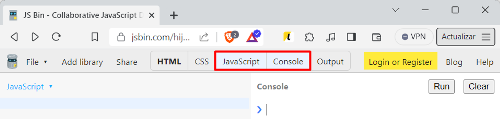

#### Horizontal tab \t 🔭

\t en minúscula se utiliza para añadir tabulaciones dentro de un texto.

Si añadimos una tabulación \t entre el Hola, y el ¿Qué tal? el resultado será el siguiente:

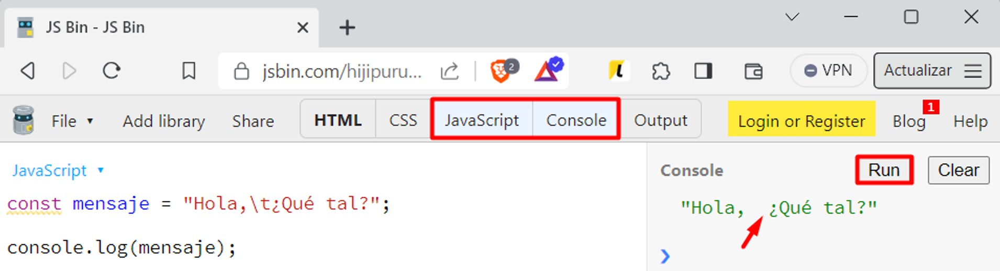

#### New line \n 🆕

\n en minúscula se utiliza para añadir una new line (salto de línea) dentro de un texto.

El resultado será el siguiente:

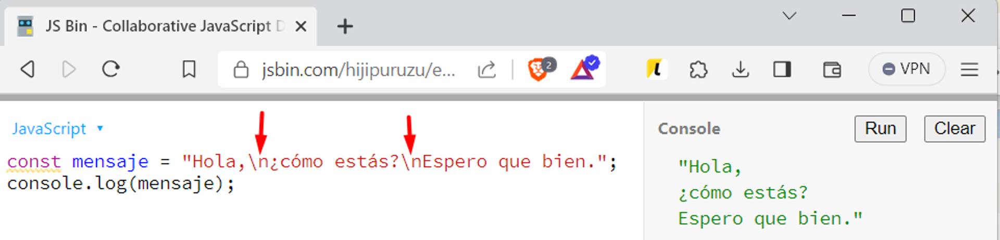

## 4. Quantifiers 🏁

### 4.1 - 0 or more times (*), 1 or more times (+), 0 or 1 time (?) ☁

#### ¿Qué son los quantifiers/cuantificadores? ⌛

Los cuantificadores dentro de las expresiones regulares (regex) son caracteres especiales que se utilizan para especificar la cantidad de veces que un elemento debe coincidir en una cadena de texto.

| 💡 Los cuantificadores permiten hacer que su patrón regex sea más flexible y conciso. Además, especifican con qué frecuencia debe coincidir una expresión regular o parte de ella. |
|-|

Basándonos sobre el siguiente texto:

```
AB
A_B
A__B
A___B
A____B
```

Con este patrón, estamos buscando los que literalmente tengan A_B:

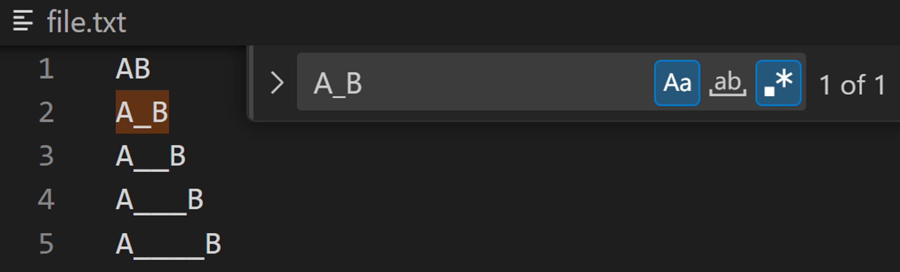

Pero ¿Cómo haríamos si quisiéramos seleccionar todos los elementos que tengan AB los que tengan barras bajas de por medio y los que no?

#### 0 or more times * 🕗

* define que el patrón o la parte del patrón definida debe coincidir cero o más veces. Vamos a ver un ejemplo:

Por ejemplo, A_*B buscará coincidencias con AB sin ninguna _ o con múltiples _ en una fila.

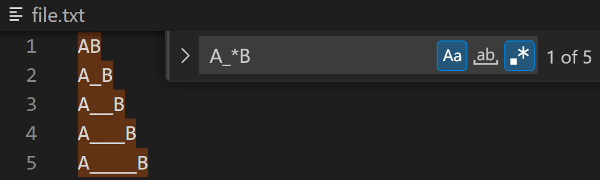

| 💡 Si nos fijamos, estamos seleccionado todos los AB, ya que con el _* le estamos especificando que nos seleccioné todos los elementos ya tenga 0, 1 o múltiples coincidencias. |
|-|

#### 1 or more times + 🕒

+ define que el patrón o la parte del patrón definida debe coincidir al menos 1 o más veces. Vamos a ver un ejemplo:

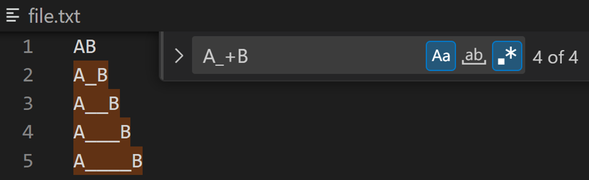

#### 0 or 1 time ? 🕕

? define que el patrón o la parte del patrón definida debe estar presente 1 vez o ninguna. Vamos a ver un ejemplo:

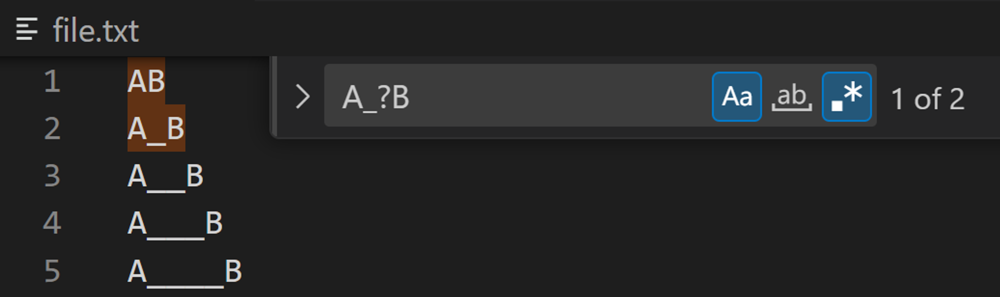

### 4.2 - Exactly n times {n}, at least n times {n,} and from n to m times {n,m} 🕛

#### Exactly n times {n} 🕛

{n} define que el patrón o la parte del patrón definida debe coincidir n veces. Vamos a ver un ejemplo:

Con este patrón A_{2}B, estamos buscando los casos que literalmente tengan literalmente dos __ entre AB:

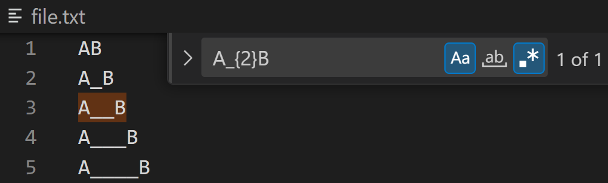

#### At least n times {n,} 🕕

{n,} define que el patrón o la parte del patrón definida debe coincidir n o más veces. Vamos a ver un ejemplo:

Con este patrón A_{2,}B, estamos buscando los casos que literalmente tengan literalmente dos __ o más _ entre AB:.

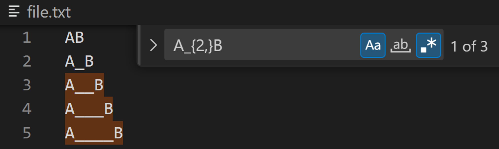

#### From n to m times {n,m} 🕖

{n,m} define que el patrón o la parte del patrón definida debe coincidir dentro del rango de n veces a m veces. Vamos a ver un ejemplo:


### 4.3 - Greedy/codicioso VS Lazy/Perezoso 🦥

La principal diferencia entre "greedy" (codicioso) y "lazy" (perezoso) en el contexto de expresiones regulares es cómo manejan las repeticiones. Estos términos se aplican a los cuantificadores, como *, +, ?, {n,m}, etc., y afectan la forma en que se realiza la coincidencia en el texto.

#### Greedy/Codicioso 💰

Greedy = ‘Codicioso’ intentará matchear la cadena más larga posible. Es decir, si tiene varias opciones donde parar irá hasta la más lejana ya que es codicioso y tiene muchas ganas de trabajar.

Basándonos sobre el siguiente texto:

```
stackoverflow
```

Con greedy (el codicioso) llegaremos a la o más lejana de las dos que tenemos:

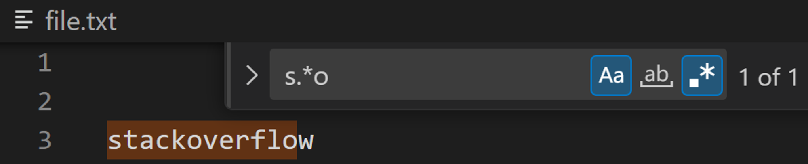

#### Lazy/Perezoso 🦥

Lazy = ‘Perezoso’ intentará coger la cadena más cercana posible. Es decir, si tiene varias opciones donde parar irá hasta la más cercana ya que es perezoso y no tiene muchas ganas de trabajar.

Con el lazy (el perezoso), en cambio, queremos acabar cuanto antes. Por lo que cogemos la cadena más corta posible. Vamos a ver un ejemplo:

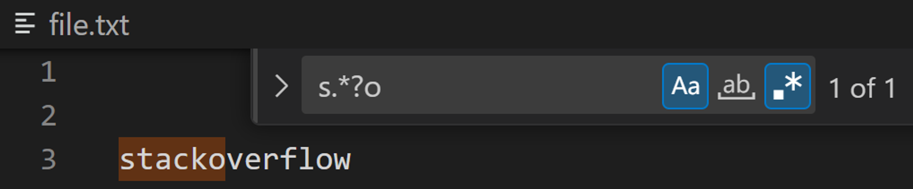

## 5. Anchors 🔱

### 5.1 - Start at beginning of String (^) & end of String ($) ⚓

Existen mecanismos, es decir ciertos caracteres ($ y ^) mediante a los cuales podemos comprobar/”anclar” si una cadena empieza o acaba por un patrón. Os explicamos como funcionan.

#### Start at beginning of String ^ ⚓

**^** el patrón empieza por…

Basándonos sobre el siguiente texto:

```
abc
babc
cabcde
ddeabc
```

Si escribimos el patrón abc, vemos que se matchearán todos los casos en los que abc esté presente. Independientemente de si está al inicio, al final o en el centro de la cadena.

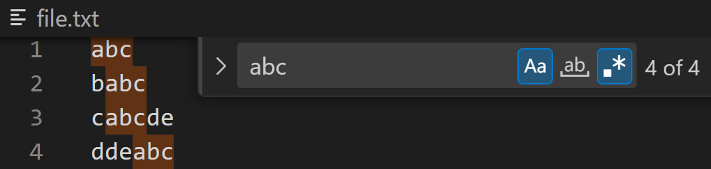

En cambio, si queremos matchear solamente los casos que empiecen por abc , debemos de añadir el ^ antes del texto. Vamos a ver un ejemplo:

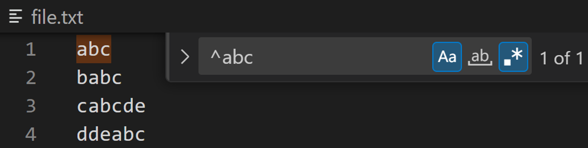

#### End of String $ 🚢

**$** El patrón acaba con…

Si queremos seleccionar las cadenas de texto que acaban pro bc, el regex para hacer el match sería el siguiente:

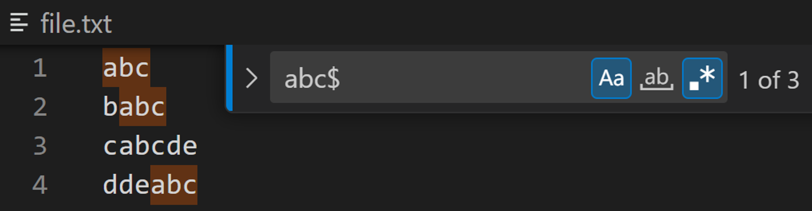

#### Combinando ^ con $ 🚢⚓

Existe también la posibilidad de que $ y ^ convivan dentro de un mismo patrón.

Por ejemplo, el siguiente ejemplo solo matcheará los casos en los que la línea empiece y acabe por abc:

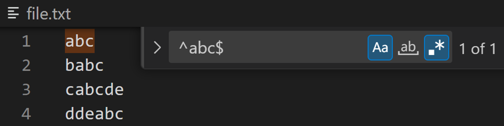

### 5.2 - Word buoundary \b & not word boundary \B 🚝

#### Word buoundary \b sin texto ⚓

\b en minúscula y sin ir englobada sobre un texto (\bTEXT\b) representa un límite de palabra (word boundary). Es decir, actúa como un ancla que marca la posición entre caracteres de palabra (alfanuméricos) y caracteres que no son de palabra (como espacios, signos de puntuación, etc.).

Inicialmente, si utilizamos \b sin nada más en el siguiente texto  podemos observar que se selecciona el inicio y fin de cada una de las palabras.

#### Word buoundary \b con texto ⚓📋

\b en minúscula, representa un límite de palabra (word boundary) actúa como delimitador de palabras lo que nos permite delimitar una palabra de inicio a fin, evitando que se cuelen subcadenas de dentro de otras palabras más largas. De tal forma que nos garantiza que estamos buscando palabras exactas en lugar de partes de palabras. Esto es especialmente útil en escenarios como la búsqueda y reemplazo de palabras en un texto.

| 💡 Englobando una palabra con \b nos aseguramos que seleccionaremos única y exclusivamente las palabras contenidas entre las dos \bWORD\b de tal manera que solamente seleccionaremos las que empiecen y acaben de tal forma. Y no las que contengan dicha palabra. |
|-|

#### Not word boundary \B caracteres de entre palabras 📖

La secuencia de escape \B matcheará a cualquier carácter siempre que no este no se encuentre en el límite de palabra. En otras palabras, coincide con posiciones dentro de palabras o entre caracteres que son todos alfanuméricos.

## 6. Alternation ⚡

### 6.1 - Alternation |

| la alternación dentro de las expresiones regulares se refiere a la capacidad de especificar múltiples alternativas sobre el patrón que busca en una cadena de texto. Para ello, se utiliza el operador de barra vertical | separando cada una de las alternativas.

### 6.2 - Match y match  matchea la expresión completa o sino no se matchea 🎯

La construcción (?(exp)yes|no) es parte de las expresiones regulares condicionales y permite definir un patrón que coincide con "yes" si la expresión condicional exp es verdadera y con "no" si es falsa. Aquí tienes un ejemplo de cómo usar esta construcción en una expresión regular:

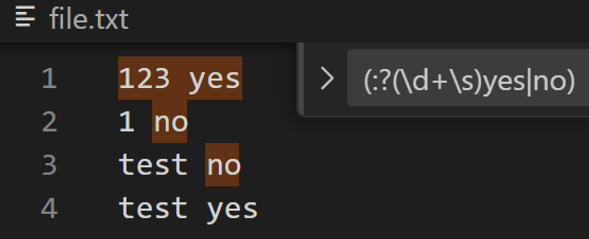

## 7. Groups rarunos 🐸

- **`\L$1`**: Todas las palabras en el grupo coincidente se cambiarán a minúsculas.
- **`\l$1`**: La primera letra en el grupo coincidente estará en minúscula, el resto permanecerá sin cambios.
- **`\U$1`**: Todas las palabras en el grupo coincidente se cambiarán a mayúsculas.
- **`\u$1`**: La primera letra en el grupo coincidente estará en mayúscula, el resto permanecerá sin cambios.

## 🥩Chuletita Cheat sheet🥩

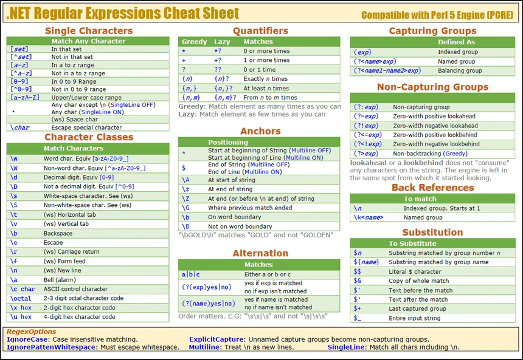

## 🤓Webs recomendadas🤓

- [**Regexr**](http://www.regexr.com/) **→** Herramienta online para probar, depurar y aprender Regex.
- [**Regex101**](https://regex101.com/) **→** Herramienta online para probar y depurar Regex en diferentes lenguajes.
- [**Regular-expressions.info**](http://www.regular-expressions.info/) **→** Web en inglés con información completa sobre Regex.